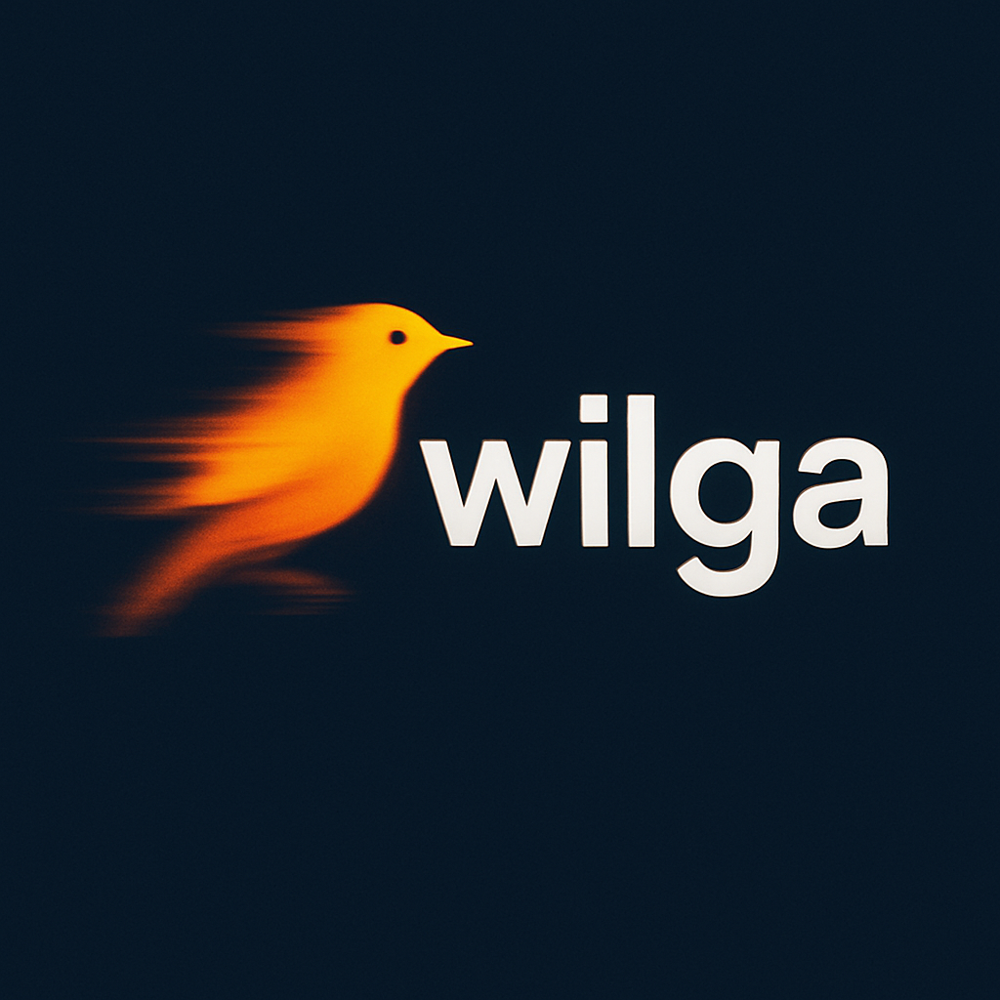

✔✔✔✔✔ Wilga — Pascal Canvas Helper

Biblioteka Wilga to prosty helper do rysowania na HTML5 Canvas przy użyciu pas2js
(Object Pascal → JavaScript).
Nie wymaga instalacji ani dodatkowych pakietów.

✔ Wymagania Wilga
1. pas2js

Potrzebujesz kompilatora pas2js, aby skompilować pliki .pas do .js.

2. Plik rtl.js

To runtime pas2js.
Musi znajdować się w tym samym folderze co:

index.html

wygenerowany program .js (np. main.js)

W pliku HTML musi być:

3. Plik index.html

Musi znajdować się w folderze projektu.
Odpowiada za ładowanie:

rtl.js

Twojego skompilowanego pliku .js

elementu <canvas> do rysowania

✔ Przykładowy index.html znajduje się w repozytorium.

4. Pliki Wilgi

Wilga składa się z kilku modułów:

wilga.pas — główny moduł

wilga_extras.pas — funkcje dodatkowe

wilga_config.inc — konfiguracja

wilga-render-worker.js

wilga_*.pas — pozostałe moduły

Wszystkie pliki razem tworzą jedną bibliotekę i nie wymagają instalacji.
Wystarczy umieścić je w projekcie lub dodać ich folder do ścieżek kompilatora pas2js.

Przykładowa kompilacja:

pas2js -Jc -O2 -Tbrowser main.pas

⚠️ Ważne: nie uruchamiaj projektu otwierając index.html bezpośrednio!

Przeglądarki blokują część funkcjonalności (CORS, JS, workery).
Projekt należy uruchamiać przez lokalny serwer HTTP.

🚀 Skrypt uruchamiający Wilgę (zalecane)

Aby ułatwić uruchamianie programu, warto zadbać o skrypt, który:

kompiluje projekt (pas2js → JS)

kopiuje/łączy wymagane pliki (np. rtl.js, index.html)

uruchamia lokalny serwer HTTP i  otwiera przeglądarkę

Pozwala to uruchomić Wilgę jednym kliknięciem.

PROJEKT POWSTAŁ WE WSPÓŁPRACY Z AI.
# Autor
Projekt Wilga rozwijany jest przez Łukasza Muchę (Bilokator).

# POZDRAWIAM I DO(KODZENIA)! 👋😄

